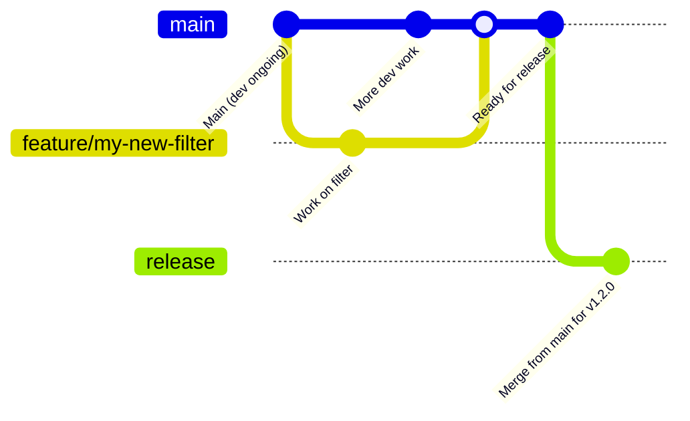
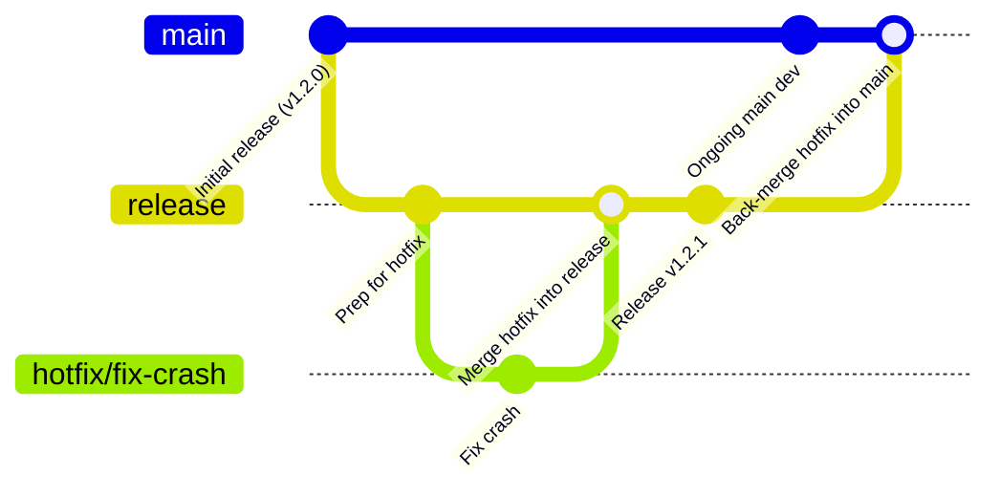

# Contributing to the Plate ID OCR Filter

Thanks for your interest in improving the **Plate ID OCR**, a lightweight OpenFilter-based utility that overlays OCR results and cropped plate images onto video frames.  
Whether you're enhancing the overlay behavior, fixing a bug, improving debug logging, or polishing the documentation — your contribution is valued.

This guide covers:

- Setting up a local development environment
- Running and writing tests
- Using the filter with the OpenFilter CLI
- Pull request and commit conventions
- Signing your commits (we follow the DCO)
- Getting help or providing feedback

---

## Topics

- [Contributing to the Plate ID OCR Filter](#contributing-to-the-plate-id-ocr-filter)
  - [Setting up your development environment](#setting-up-your-development-environment)
  - [Running tests](#running-tests)
  - [Using with the OpenFilter CLI](#using-with-the-openfilter-cli)
  - [Reporting issues](#reporting-issues)
  - [Contribution guidelines](#contribution-guidelines)
    - [Pull request process](#pull-request-process)
    - [Commit message format](#commit-message-format)
    - [Sign your commits (DCO)](#sign-your-commits-dco)
  - [Style and conventions](#style-and-conventions)
  - [Release process](#release-process)
  - [Thank you](#thank-you-🙏)

---

## Setting up your development environment

The Plate ID OCR is a standalone Python package built with [OpenFilter](https://github.com/PlainsightAI/openfilter).

To set up your environment:

```bash
git clone https://github.com/PlainsightAI/filter-license-annotation-demo.git
cd filter-license-annotation-demo
# (Optional but recommended) create a virtual environemnt:
python -m venv venv && source venv/bin/activate
make install
````

This installs the filter and its dependencies.

### Quick test

Run the filter directly with:

```python
from openfilter.filter_runtime.filter import Filter
from filter_license_plate_detection.filter import FilterLicensePlateDetection
from filter_crop.filter import FilterCrop
from filter_optical_character_recognition.filter import FilterOpticalCharacterRecognition
from filter_license_annotation_demo.filter import FilterLicenseAnnotationDemo
from openfilter.filter_runtime.filters.video_in import VideoIn
from openfilter.filter_runtime.filters.webvis import Webvis

if __name__ == '__main__':
    Filter.run_multi([
        (VideoIn, dict(
            sources='file://example_video.mp4!loop',
            outputs='tcp://*:5550',
        )),
        (FilterLicensePlateDetection, dict(
            sources='tcp://localhost:5550',
            outputs='tcp://*:5552',
        )),
        (FilterCrop, dict(
            sources='tcp://localhost:5552',
            outputs='tcp://*:5554',
            detection_key='license_plate_detection',
            detection_class_field='label',
            detection_roi_field='box',
            output_prefix='cropped_',
            mutate_original_frames=False,
            topic_mode='main_only',
        )),
        (FilterOpticalCharacterRecognition, dict(
            sources='tcp://localhost:5554',
            outputs='tcp://*:5556',
            topic_pattern='license_plate',
            ocr_engine='easyocr',
            forward_ocr_texts=True,
        )),
        (FilterLicenseAnnotationDemo, dict(
            sources='tcp://localhost:5556',
            outputs='tcp://*:5558',
            cropped_topic_suffix='license_plate',
        )),
        (Webvis, dict(
            sources='tcp://localhost:5558',
        )),
    ])
```

Or [use the OpenFilter CLI](#using-with-the-openfilter-cli)

---

## Running tests

The test suite is located in `tests/test_filter_license_annotation_demo.py`.

Run it directly with:

```bash
pytest -v tests/test_filter_license_annotation_demo.py
```

Or run all tests with:

```bash
make test
```

If you're modifying logic for OCR overlay, cropped image display, or environment config parsing, ensure your changes are well-covered by tests.

---

## Using with the OpenFilter CLI

To run the filter as part of a complete video pipeline:

```bash
openfilter run \
	- VideoIn \
		--sources 'file://example_video.mp4!loop' \
	- filter_license_plate_detection.filter.FilterLicensePlateDetection \
	- filter_crop.filter.FilterCrop \
		--detection_key license_plate_detection \
		--detection_class_field label \
		--detection_roi_field box \
		--output_prefix cropped_ \
		--mutate_original_frames false \
		--topic_mode main_only \
	- filter_optical_character_recognition.filter.FilterOpticalCharacterRecognition \
		--topic_pattern 'license_plate' \
		--ocr_engine easyocr \
		--forward_ocr_texts true \
	- filter_license_annotation_demo.filter.FilterLicenseAnnotationDemo \
		--cropped_topic_suffix license_plate \
	- Webvis
```

Or run the demo pipeline from the repo root:

```bash
make run
```

Ensure the plugin is installed and importable (e.g., via `PYTHONPATH` or proper registration).

---

## Reporting issues

Found a bug in how the inset image is drawn? Text overlays misaligned? Configuration not respected?

Please [open an issue](https://github.com/PlainsightAI/filter-license-annotation-demo/issues/new) and include:

* What you were trying to do
* What actually happened
* Any relevant config, CLI args, or logs
* Whether the issue is frame-specific, format-specific, or environment-specific

Minimal reproductions or failing tests are especially helpful.

---

## Contribution guidelines

### Pull request process

* Create a feature branch (e.g., `add-env-support`, `fix-text-alignment`)
* Keep your changes focused and isolated
* Include or update tests when needed
* Run `make test` before pushing
* Sign your commits (see below)
* Open your PR against `main`

If your change affects existing behavior, document it clearly in the PR.

### Commit message format

Structure your commit messages like this:

```
Short summary (max 50 chars)

Optional details with rationale or explanation.
Reference any issues using "Closes #123".
```

Use the `-s` flag to sign off your commits (see next section).

---

### Sign your commits (DCO)

We follow the **Developer Certificate of Origin (DCO)**. All commits must be signed.

```bash
git commit -s -m "Improve overlay placement logic"
```

This adds a line like:

```
Signed-off-by: Your Name <your.email@example.com>
```

Unsigned commits will fail CI.

More details: [developercertificate.org](https://developercertificate.org)

---

## Style and conventions

* Format code with `black`
* Lint using `ruff`
* Use type hints for public methods (`process()`, `normalize_config()`, etc.)
* Prefer explicit, testable logic
* Comment any non-obvious parsing or overlay logic

### Docstrings

Document:

* Config fields in `FilterLicenseAnnotationDemoConfig`
* Main logic in `process()` including fallback behavior
* Edge-case handling (e.g., missing cropped frame, invalid OCR, fit failures)

---

## Release Process

OpenFilter uses a structured release workflow to ensure stability, transparency, and traceability of code changes.

Whether you're contributing a quick fix or a large feature, it's important to understand how changes move from your local branch into production.

### 🧵 Development Flow

- All contributors (including maintainers) **branch off of `main`** for any feature, bugfix, or documentation update.
- Pull requests should always **target `main`**, which serves as the active development branch.
- Once PRs are approved and merged into `main`, they are queued for inclusion in the next release.

> 🔒 **Important:** Only **core maintainers** are allowed to merge `main` into `release`. This ensures all published versions are stable, reviewed, and correctly documented.

### 🛠️ Releasing

- Releases are **cut from the `release` branch**, which always reflects the **latest stable version** of OpenFilter.
- To merge from `main` into `release`, the following must be true:
  - The `RELEASE.md` file contains an accurate and up-to-date changelog entry for the version.
  - The `VERSION` file matches the version declared in `RELEASE.md`.

> This guards against accidental or incomplete releases and ensures that the changelog is always reliable.

Once merged, the release automation tags the version, pushes a GitHub release, publishes documentation, and optionally builds artifacts (e.g., Docker images, Python wheels).

### 🧯 Hotfixes

Occasionally, an urgent fix may need to be deployed without waiting for the next full release cycle.

- In these cases, hotfix branches are **cut from the `release` branch**, not `main`.
- Once the fix is ready, it's:
  1. Merged back into `release`
  2. Then merged **forward into `main`** to ensure future releases retain the hotfix.

This guarantees the stability of released versions without introducing unreviewed changes from `main`.

---

### 🔄 Diagram: Standard Release Flow



### 🚑 Diagram: Hotfix Flow



---

## Thank you 🙏

Your interest in improving this filter helps everyone working with OCR pipelines and visual annotation tools.

Whether you’re fixing a visual bug, extending support for new formats, or just clarifying documentation — thank you.

Feel free to [open an issue](https://github.com/PlainsightAI/filter-license-annotation-demo/issues) or a pull request anytime!